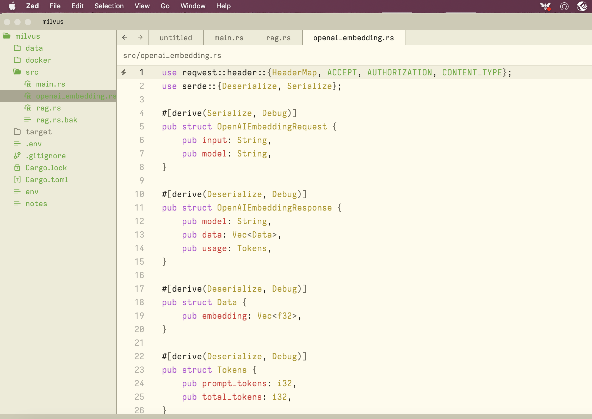

# rust_openai_example

Currently, the project is in its early stages. The immediate ambition is to mimic the behavior of langchain for RAG using pure Rust code
instead of Python. For now, OpenAI models are used for inference.

